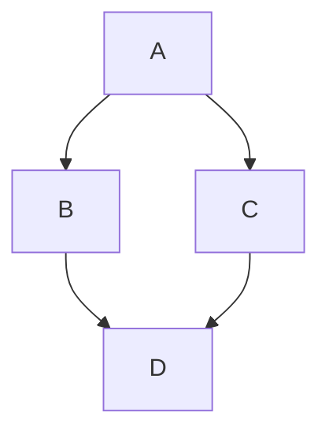

{ width=100% }

# Introduction{-}

{ width=15% style="float:right; padding:10px" }

This tutorial introduces R Notebooks as a powerful tool for combining code, output, and narrative in a single, dynamic document. It shows how to use R Notebooks with Markdown to streamline analysis, improve transparency, and enhance reproducibility in linguistic and data science research.

This tutorial is intended for researchers working with language data, particularly those in the humanities and social sciences. It is especially useful for beginner to intermediate R users who want to document their work more clearly and share it in a readable and executable format.

{ width=40% style="float:right; padding:10px" }

R Notebooks provide a flexible interface for combining code chunks with descriptive text using Markdown. They allow users to run code interactively, view the output inline, and export polished reports in various formats (HTML, PDF, Word) with minimal effort.

By following this tutorial, you will learn the basics of R Notebooks, how to structure a notebook using Markdown, include and execute R code chunks, customise the output, and render your work as a fully reproducible document. These skills are essential for creating research outputs that are easy to understand, verify, and replicate.

The tutorial will also cover how R Notebooks differ from traditional R Markdown documents, how to track changes effectively, and how to use notebooks for collaborative writing and analysis. By adopting these practices, you foster openness and transparency in your research while improving your own workflow.

# Creating R Notebooks

While many R users are familiar with R scripts and R Markdown, R Notebooks provide an ideal middle ground by enabling live execution, inline outputs, and seamless reporting. They are especially useful for iterative data exploration and producing well-documented, shareable code.

{ width=40% style="float:right; padding:10px" }

Creating an R Notebook in RStudio is simple. From the **File** menu, choose **New File > R Notebook**. This creates a document with the `.Rmd` extension and a YAML header specifying the notebook format. You can add narrative text using Markdown syntax and insert code chunks with R commands that execute inline.

The next sections will guide you through building your first notebook, using Markdown effectively, embedding plots and tables, and exporting your results as clean, formatted documents.

```{r setup, echo=FALSE, message=FALSE, warning=FALSE}
# load packages used in this tutorial
library(knitr)
library(tidyverse)
```

# Markdown

{ width=25% style="float:right; padding:10px" }

Markdown is a lightweight markup language that you can use to add formatting elements to plaintext text documents. Markdown's simplicity and readability render it attractive for a wide range of writing and documentation tasks. Its flexibility allows it to be extended to suit more complex needs, making it a versatile tool. Created by John Gruber in 2004, its primary purpose is to allow people to write in an easy-to-read and easy-to-write plain text format, which can then be converted to structurally valid HTML (or other formats such as docx or pdf). Markdown is widely used for documentation, web writing, and content creation because of its simplicity and flexibility. Markdown provides an authoring framework for data science as Markdown can produce  high quality reports that can be shared with an audience. The advantage of Markdown is that you can use a single Markdown file (or Markdown document) to combine:

* executable code

* code output (such as visualisations and results of calculations)

* plain text (to explain, report, and document)

R Markdown documents are fully reproducible and support dozens of static and dynamic output formats. Here are some key points about Markdown:

* *Simplicity*: Markdown syntax is designed to be readable and easy to write. It avoids the complexity of other markup languages, making it accessible even for non-technical users.

* *Plain Text Formatting*: Since Markdown is written in plain text, it can be created and edited in any text editor. This makes it highly portable and version control friendly.

* *Conversion*: Markdown can be easily converted to HTML, making it ideal for web content. Many static site generators and content management systems support Markdown natively.

* *Extensibility*: While the core syntax is intentionally simple, Markdown can be extended with plugins or additional syntaxes for more advanced features like tables, footnotes, and embedded content.

Common Uses of Markdown include, for example, *documentation*, *read-me files*, *notes*, and *to-do lists*,  because it is easy to read in its raw form and can be rendered beautifully in web browsers.


Check out [this introduction](https://rmarkdown.rstudio.com/) to R Markdown by RStudio and have a look at [this R Markdown cheat sheet](https://www.rstudio.com/wp-content/uploads/2015/02/rmarkdown-cheatsheet.pdf).

Here's a guide with commands on the top and their rendered output below.

## Headings {-}

**Command:**

```markdown
# Heading 1
## Heading 2
### Heading 3
#### Heading 4
##### Heading 5
###### Heading 6
```

**Rendered:**

# Heading 1
## Heading 2
### Heading 3
#### Heading 4
##### Heading 5
###### Heading 6


## Headings with Links{-}

**Command:**

```markdown
### [Heading with a Link](https://www.example.com)
```

**Rendered:**

### [Heading with a Link](https://www.example.com)


## Custom IDs for Headings

**Command:**

```markdown
### Custom ID Heading {#custom-id}
```

**Rendered:**

### Custom ID Heading {#custom-id}

## Table of Contents {-}

**Command:**

```markdown
## Table of Contents
- [Headings](#headings)
- [Blockquotes](#blockquotes)
- [Images](#images)
- [Tables](#tables)
```

**Rendered:**

## Table of Contents
- [Headings](#headings)
- [Blockquotes](#blockquotes)
- [Images](#images)
- [Tables](#tables)


## Emphasis {-}

**Command:**

```markdown
*Italic text*
_Italic text_

**Bold text**
__Bold text__

***Bold and italic***
___Bold and italic___
```

**Rendered:**

*Italic text*  
_Italic text_

**Bold text**  
__Bold text__

***Bold and italic***  
___Bold and italic___


## Strikethrough {-}

**Command:**

```markdown
This is a ~~strikethrough~~ example.
```

**Rendered:**

This is a ~~strikethrough~~ example.


## Superscript and Subscript {-}

**Command:**

```markdown
H~2~O and E=mc^2^
```

**Rendered:**

H~2~O and E=mc^2^

## Highlight{-}

**Command:**

```markdown
I need to ==highlight== this text.
```

**Rendered:**

I need to ==highlight== this text.


## Emojis {-}

**Command:**

```markdown
Here is an emoji: :smile:
```

**Rendered:**

Here is an emoji: :smile:

## Emoji Shortcodes {-}

**Command:**

```markdown
:smile: :+1: :sparkles:
```

**Rendered:**

:smile: :+1: :sparkles:

## Lists {-}

### Unordered List {-}

**Command:**

```markdown
- Item 1
- Item 2
  - Subitem 2.1
  - Subitem 2.2
- Item 3
```

**Rendered:**

- Item 1
- Item 2
  - Subitem 2.1
  - Subitem 2.2
- Item 3

### Ordered List {-}

**Command:**

```markdown
1. First item
2. Second item
3. Third item
   1. Subitem 3.1
   2. Subitem 3.2
```

**Rendered:**

1. First item
2. Second item
3. Third item
   1. Subitem 3.1
   2. Subitem 3.2

### Task Lists {-}

**Command:**

```markdown
- [x] Completed task
- [ ] Incomplete task
- [ ] Another incomplete task
```

**Rendered:**

- [x] Completed task
- [ ] Incomplete task
- [ ] Another incomplete task


### Advanced Task Lists {-}

**Command:**

```markdown
- [ ] Task 1
  - [x] Subtask 1
  - [ ] Subtask 2
- [x] Task 2
```

**Rendered:**

- [ ] Task 1
  - [x] Subtask 1
  - [ ] Subtask 2
- [x] Task 2


### Definition Lists {-}

**Command:**

```markdown
First Term
: This is the definition of the first term.

Second Term
: This is the definition of the second term.
```

**Rendered:**

First Term  
: This is the definition of the first term.

Second Term  
: This is the definition of the second term.


### Nested Lists {-}

**Command:**

```markdown
1. First item
   - Subitem 1
     - Sub-subitem 1
   - Subitem 2
2. Second item
```

**Rendered:**

1. First item
   - Subitem 1
     - Sub-subitem 1
   - Subitem 2
2. Second item


## Links {-}

**Command:**

```markdown
[LADAL](/)
```

**Rendered:**

[LADAL](/)

## Images {-}

**Command:**

```markdown

```

**Rendered:**


## Images with Links {-}

**Command:**

```markdown
[](https://www.example.com)
```

**Rendered:**

[](https://www.example.com)


## Blockquotes {-}

**Command:**

```markdown
> This is a blockquote.
> 
> This is a second paragraph within the blockquote.
```

**Rendered:**

> This is a blockquote.
> 
> This is a second paragraph within the blockquote.

## Blockquotes with Multiple Paragraphs {-}

**Command:**

```markdown
> This is a blockquote with multiple paragraphs.
>
> This is the second paragraph in the blockquote.
```

**Rendered:**

> This is a blockquote with multiple paragraphs.
>
> This is the second paragraph in the blockquote.


## Code {-}

### Inline Code {-}

**Command:**

```markdown
`inline code`
```

**Rendered:**

`inline code`

### Code Block {-}

**Command:**

<pre markdown="1">
```markdown
{
  "firstName": "Martin",
  "lastName": "Schweinberger",
  "age": 43
}
```
</pre>

**Rendered:**

```json
{
  "firstName": "John",
  "lastName": "Smith",
  "age": 25
}
```

## Blockquotes with Nested Elements {-}

**Command:**

```markdown
> ### This is a heading
> - This is a list item within a blockquote
> - Another item
>
> > This is a nested blockquote
```

**Rendered:**

> ### This is a heading
> - This is a list item within a blockquote
> - Another item
>
> > This is a nested blockquote

## Inline HTML {-}

**Command:**

```markdown
<p>This is an inline HTML paragraph.</p>
```

**Rendered:**

<p>This is an inline HTML paragraph.</p>


## HTML Entities{-}

**Command:**

```markdown
AT&T &copy; 2024
```

**Rendered:**

AT&T &copy; 2024


## Expandable Sections (Details Tag){-}

**Command:**

```markdown
<details>
  <summary>Click to expand</summary>
  This is the detailed content that is hidden until expanded.
</details>
```

**Rendered:**

<details>
  <summary>Click to expand</summary>
  This is the detailed content that is hidden until expanded.
</details>


## Horizontal Rule {-}

**Command:**

```markdown
***
```

## Tables {-}

**Command:**

```markdown
| Header 1 | Header 2 |
|----------|----------|
| Cell 1   | Cell 2   |
| Cell 3   | Cell 4   |
```

**Rendered:**

| Header 1 | Header 2 |
|----------|----------|
| Cell 1   | Cell 2   |
| Cell 3   | Cell 4   |


## Advanced Tables {-}

**Command:**

```markdown
| Header 1 | Header 2 | Header 3 |
|----------|----------|----------|
| Row 1 Col 1 | Row 1 Col 2 | Row 1 Col 3 |
| Row 2 Col 1 | Row 2 Col 2 | Row 2 Col 3 |
```

**Rendered:**

| Header 1    | Header 2    | Header 3    |
|-------------|-------------|-------------|
| Row 1 Col 1 | Row 1 Col 2 | Row 1 Col 3 |
| Row 2 Col 1 | Row 2 Col 2 | Row 2 Col 3 |


## Footnotes {-}

**Command:**

```markdown
Here is a simple footnote[^1].

[^1]: This is the footnote.
```

**Rendered:**

Here is a simple footnote[^1] (you can find it at the end/bottom of this document).

[^1]: This is the footnote.


## Syntax Highlighting {-}

**Command:**

<pre markdown="1">
```python
def hello_world():
    print("Hello, world!")
```
</pre>

**Rendered:**

```python
def hello_world():
    print("Hello, world!")
```


## Math Expressions {-}

**Command:**

```markdown
Inline math: $E = mc^2$

Block math:
$$
\frac{a}{b} = c
$$
```

**Rendered:**

Inline math: \( E = mc^2 \)

Block math:

$$
\frac{a}{b} = c
$$


## Escaping Characters {-}

**Command:**

```markdown
Use the backslash to escape special characters: \*literal asterisks\*
```

**Rendered:**

Use the backslash to escape special characters: \*literal asterisks\*


## Mermaid Diagrams {-}

**Command:**

```markdown

```

**Rendered:**


These additional advanced Markdown features allow you to create even more complex and sophisticated documents. Practice using these commands to further enhance your Markdown proficiency!


# Citation & Session Info {-}

Schweinberger, Martin. 2025. *Creating R Notebooks with Markdown*. Brisbane: The University of Queensland. url: https://ladal.edu.au/tutorials/notebooks/notebooks.html (Version 2025.08.01).

```
@manual{schweinberger2025notebooks,
  author = {Schweinberger, Martin},
  title = {Creating R Notebooks with Markdown},
  note = {tutorials/notebooks/notebooks.html},
  year = {2025},
  organization = {The University of Queensland, School of Languages and Cultures},
  address = {Brisbane},
  edition = {2025.08.01}
}
```


```{r fin}
sessionInfo()
```


***

[Back to top](#introduction)

[Back to HOME](/)

***


